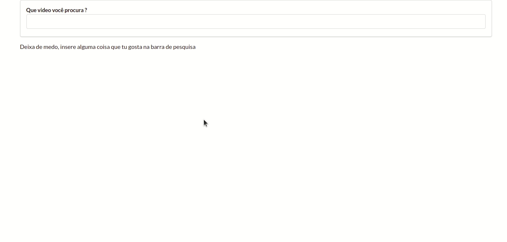

<h1 aling="center">videos</h1>

<h2>Description</h2>
<p>
  This project is created for perpetuate knowledge in reactjs, part of <a href="https://www.udemy.com/course/react-redux/">"Modern React with Redux"</a> course.

  I load videos according to a string, in other words, simulating YouTube's behavior.
</p>
<h2>Installation</h2>
<p>
  You will need Nodejs, NPM and Git installed in your machine. After, run the scripts below:

  ```
  # Clone this repository
  $ git clone https://github.com/guilherme4g/videos.git

  # Access the project folder in the terminal
  $ cd videos

  # Install the dependencies
  $ npm install

  # Run the application
  $ npm run start
  ```
</p>
